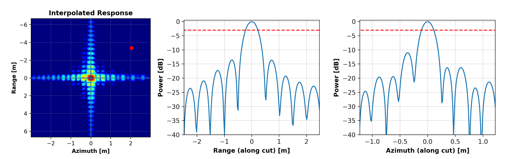

.. _quality_pta:

Point Target Data Analysis
==========================

This analysis consist in computing an measuring quality parameters from SAR products containing information about point
targets (mainly passive corner reflectors) in the recorded scene.

Impulse Response Function (IRF), Radar Cross-Section (RCS) estimation and Localization Errors can be assessed from the input
product providing the location of point target in the scene with an external file.

Computed and Estimated quantities
^^^^^^^^^^^^^^^^^^^^^^^^^^^^^^^^^

A full list of the output quantities that can be computed and estimated during this process can be found here, grouped by
the parent quality analysis they belong to. All these groups can be enabled or disabled during the analysis if needed
(by default they are all enabled).

**Impulse Response Function (IRF)**

    | **Range**: resolution, PSLR [#]_, ISLR [#]_, SSLR [#]_
    | **Azimuth**: resolution, PSLR, ISLR, SSLR
    | **2D**: PSLR, ISLR, SSLR

**Radar Cross-Section (RCS)**

    | **2D**: RCS, RCS Errors, Peak Phase Error, Clutter, SCR [#]_

**Localization Errors**

    | **Range**: slant localization error, ground localization error
    | **Azimuth**: localization error

Analysis Algorithm
^^^^^^^^^^^^^^^^^^

The whole Point Target Data Analysis algorithm is divided in several stages needed to properly assess all the desired quantities
starting from the input SAR product. 

Image Pre-Processing
~~~~~~~~~~~~~~~~~~~~

Two pre-processing steps aimed at improving the quality of the estimated calibration parameters are performed.

1. Automatic identification of the point target within the SAR image (an external point targets positions files is required)
2. 2D oversampling of the area of the image where the point target is located

.. note::

    Targets that are too close to each other (ideally less than 20 resolution cells) may suffer from mutual interference and
    intensity close to the background clutter.

*Step 2* consists in an ideal interpolation of the data in the spectral domain. Default interpolation factor is 8 or 16 depending
on the analysis to be performed.
Oversampled image is centered around the point target signal peak which position is determined with sub-pixel precision.

.. note::

    Most of the pre-processing algorithm parameters can be edited using a configuration file, in particular:

    | **peak_finding_roi_size**: size of the swath portion around the theoretical point target location where to search for the signal peak
    | **analysis_roi_size**: size of the swath portion centered on the signal peak before oversampling
    | **oversampling_factor**: factor of oversampling for IRF quality analysis

Resolution Estimation
~~~~~~~~~~~~~~~~~~~~~

The SAR resolution in the azimuth (along-track) and range (cross-track) directions is defined as the -3 dB lobe width of
the 2D IRF sections intersecting at IRF peak.

The theoretical resolution can be predicted from the processing parameter of the products according to:

.. math::

    \begin{align*}
    Res_{th, rng} &= 0.886 * \frac{c}{2 B_{rng}}  a_{win, rng} \\
    Res_{th, az} &= 0.886 * \frac{v_{sat, grd}}{B_{az}}  a_{win, az}
    \end{align*}

where :math:`c` is the speed of light, :math:`B_{rng}` is the transmitted pulse bandwidth, :math:`v_{sat, grd}` is the
sensor velocity projected on ground, :math:`B_{az}` is the processed azimuth bandwidth and :math:`a_{win, rng}` and 
:math:`a_{win, az}` are the IRF broadening factors corresponding to the Hamming spectral weighting used for side lobe levels reduction.
The term 0.886 accounts for the fact that resolution is measured at -3 dB of the IRF and not at the first 0.

The theoretical resolution values can be compared against the resolution measured from the oversampled image around the
point target location. Profiles along range and azimuth directions are then extracted and the 3 dB lobe width in pixels
:math:`\Delta Px_{-3dB}` is measured. The measured width can then be converted into resolution values in meters multiplying by
the proper step factor:

.. math::
    \begin{align*}
    Res_{data, rng} &= \Delta Px_{rng, -3dB} * step_{rng} \\
    Res_{data, az} &= \Delta Px_{az, -3dB} * step_{az}
    \end{align*}

.. important::

    A measured resolution higher than the theoretical one can be an indicator of some issue at processing level
    (e.g. inaccurate orbit information available).

IRF Analysis: side lobes levels
~~~~~~~~~~~~~~~~~~~~~~~~~~~~~~~

The side lobe levels control is a fundamental step of SAR processing: it's implemented applying a Hamming window
to the range and azimuth spectra.

The side lobe levels are evaluated from specific portions of the SAR image, as shown in the picture below.

**Peak to Side Lobe Ratio (PSLR)**

    | **Definition**: the ratio between the maximum intensity of the peak area and the maximum intensity of side lobes area
    | **Aim**: assessing the contrast (i.e., the capability of distinguishing two adjacent PTs) or of the blurring of the PT
    | **Measured quantity**: measures the leakage of main lobe energy into side lobes
    | **Peak Area Boundaries**: 2 resolution cells (:math:`Res_{Peak}`) neighborhood centered on peak
    | **Side Area Boundaries**: :math:`\left\{ -5* Res_{Peak} < Side Area < - Res_{Peak}\right\} \cup \left\{Res_{Peak} < Side Area < 5* Res_{Peak}\right\}` neighborhood around Peak Area

Example formula for computing PSLR:

.. math::

    PSLR_{rng/az} = -10 \cdot \log_{10} \left(\frac{\max\left\{|S_{Peak Area}|^2\right\}}{\max\left\{|S_{Side Area}|^2\right\}}\right)

PSLR can be computed separately for range and azimuth starting from their profiles extracted from the oversampled image,
given that usually different Hamming windows are used in processing.
PSLR 2D is defined as the worst of the two measured PSLR values.

**Integrated Side Lobe Ratio (ISLR)**

    | **Definition**: the ratio between the integrated intensity of the peak area and the integrated intensity of side lobes area
    | **Aim**: assessing the ratio of energy associated with the main lobe with regards to the energy of the side lobes
    | **Measured quantity**: how much energy is inside the side lobes instead of main lobe
    | **Peak Area Boundaries**: 2 resolution cells neighborhood from peak
    | **Side Area Boundaries**: 9 resolution cells neighborhood around Peak Area

Example formulas for computing ISLR:

.. math::
    \begin{align*}
    ISLR_{rng} &= -10 \cdot \log_{10} \left(\frac{\int_{Peak}|S(rng)|^2 dS_{rng}}{\int_{Side}|S(rg)|^2 dS_{rng}} \right) \\
    ISLR_{az} &= -10 \cdot \log_{10} \left(\frac{\int_{Peak}|S(az)|^2 dS_{az}}{\int_{Side}|S(az)|^2 dS_{az}} \right) \\
    ISLR_{2D} &= -10 \cdot \log_{10} \left(\frac{\iint_{2DPeak}|S|^2 dS}{\iint_{2DSide}|S|^2 dS} \right)
    \end{align*}

The measured PSLR and ISLR can be compared with the theoretical values from the processing parameters applicable to the
product under analysis. Discrepancies between the measured and theoretical values could hint some problems during the
processing of the data.

It is worth noting that side lobe levels measurement from real data requires a very good SCR in order to get unbiased
estimates, particularly in case of heavy Hamming weighting resulting in very low side lobe levels.

**Secondary Side Lobe Ratio (SSLR)**

    | **Definition**: ?
    | **Aim**: ?
    | **Measured quantity**: ?
    | **Peak Area Boundaries**: ?
    | **Side Area Boundaries**: ?

TBD

RCS Estimation
~~~~~~~~~~~~~~

Radar Cross Section (RCS) estimation is aimed at the assessment/derivation of the absolute radiometric calibration and
polarimetric co-registration of the SAR product. The RCS estimation process foresees the measurement of the energy falling
within the main lobe of the focused point target and the removal of the background energy estimated in image regions outside the 2D IRF.

The input data shall be provided in *beta-nought* with no incidence angle compensation applied.

The RCS estimation algorithm is composed by the following steps:

1. Image conversion to intensity by taking the square of the absolute value of each pixel.

2. Background intensity (Clutter) estimation by averaging the pixel intensities over four square areas of M x M pixels located close to each
   corner around the target in such a way that they include only clutter intensity.

3. Background intensity removal from image by subtraction.

4. Evaluation of RCS as integration of the intensity over the pixels belonging to the main lobe of the IRF multiplying by the pixel area in
   the slant range plane.

5. Evaluation of SCR as ratio between RCS and Intensity background value. The higher the SCR the more accurate the estimated target RCS.

Computing the difference between the measured RCS of a well-characterized known target and its real RCS allows to perform
the absolute radiometric calibration.

The channel distortion can also be measured as the difference in a corner reflector RCS between two polarization.

Point Target Localization
~~~~~~~~~~~~~~~~~~~~~~~~~

The geolocation accuracy can be measured from a point target SAR image by comparing the position of the peak of the target
in the SAR data with the expected position computed with an inverse geocoding operation from the target ground position
and the platform orbit.

The comparison is performed in SAR SLC domain (azimuth and range times domain) according to the following procedure:

1. The accurate position of the target in the SAR data is measured from the 2D oversampled image, both as pixel coordinates and
   range/azimuth times.

2. The nominal ground position of the point target is converted in SAR coordinates though an inverse geocoding operation solving
   the following non-linear equation with numeric methods (Newton-Raphson):

   .. math::
        [P - S(t_{az})] * V(t_{az}) - \frac{f_{DC} * \lambda}{2} * |P - S(t_{az})| = 0

   where :math:`\lambda` is the sensor wavelength.

3. The geolocation error is then expressed as the difference between the measured and predicted target position in SAR coordinates and/or
   in space coordinates:

   .. math::
        \begin{align*}
        \epsilon_{rng} &= t_{rng,\, pred} - t_{rng,\, meas} \\
        \epsilon_{az} &= t_{az,\, pred} - t_{az,\, meas}
        \end{align*}

The measured geolocation error is expected to be as close to 0 as possible. When discrepancies are observed the main causes can be:

- Orbital information inaccuracy resulting in errors either in range and/or azimuth directions

- Instrument internal delays not properly compensated and introducing errors in the range direction

- Additional propagation delay through troposphere (for all bands) and ionosphere (especially for L and lower bands but
  possible also for higher bands in case of strong ionosphere). Such delay is usually not compensated at processing level
  and shall then be compensated in post processing to improve the accuracy of the process.

- Geodynamics effects introducing small shifts in azimuth and range directions. Similar to troposphere and ionosphere,
  such effects are not compensated at processing level but, only for high resolution data given the small magnitude, can be compensated in pre or post processing.

In case of polarimetric data, the *polarimetric co-registration* can be performed by measuring the difference in a point
target location between two polarization channels.

Analysis Output
^^^^^^^^^^^^^^^

Point Target data analysis output consists in a .csv report file containing results for each target and each channel analyzed.
Graphical output can also be generated using the ``graphical_output.irf_parameters`` and ``graphical_output.rcs_parameters``
functions to obtain classic IRF, RCS and Localization summary plots.

.. note::

    Graphical output functionalities are available only if the package has been installed with the [graphs] optional
    dependencies. Refer to the :ref:`installation documentation<quality_install>` for more information.

Footnotes
^^^^^^^^^

.. [#] Peak-to-Side-Lobe-Ratio

.. [#] Integral-Side-Lobe-Ratio

.. [#] Secondary-Side-Lobe-Ratio

.. [#] Signal-to-Clutter-Ratio
