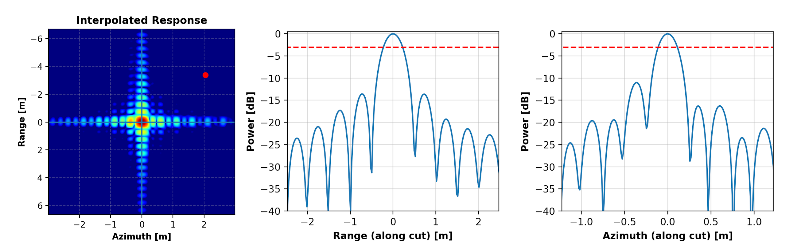

.. _quality_docs_mainpage:

#################################
Arepyextras Quality Documentation
#################################

.. toctree::
   :maxdepth: 2
   :hidden:

   install  
   reference/api/index
   changelog
   documentation/index

`Arepyextras Quality` is the Aresys Python toolbox for SAR quality data processing.
This package supports Aresys internal Product Folder format by default but its main functionalities can be used providing
a protocol-compliant input object that can be generated starting from any kind of source.

The following analyses have been implemented:

- **Point Target Analysis**: Impulse Response Function (IRF), Radar Cross Section (RCS) and Localization Errors
- **Radiometric Analysis**: Noise Equivalent Sigma-Zero (NESZ), Average Elevation Profiles, Scalloping Profiles and custom radiometric profiles
- **Interferometric Analysis**: interferometric coherence analysis and graphical representation
